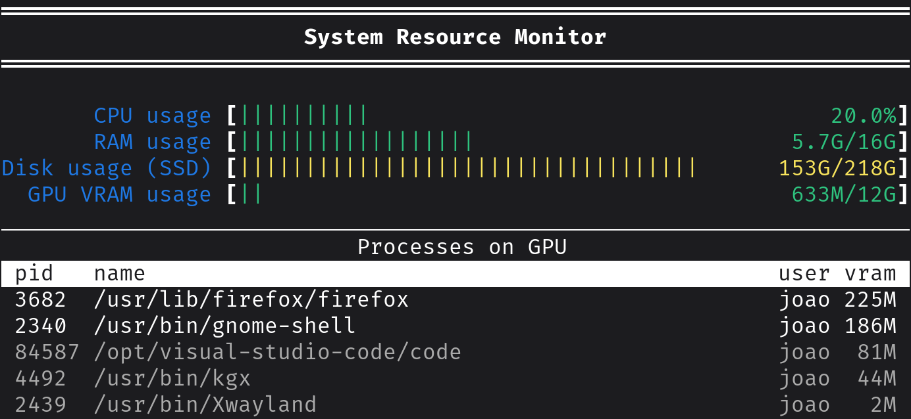

# System Resource Monitor

A simple resource monitor that shows the current CPU, RAM, drive and GPU usages, along with current GPU processes. This is useful to use on a machine learning lab infrastructure: run it when a user logs in via SSH and they'll have info on the machine's resources.

### Installing

Install the requirements (only `psutil`):

```sh
pip install -r requirements.txt
```

Then run:
```sh
python3 usage.py
```

Here are the available options for running the script:

* `--disks` -
  Disks to show. Provide pairs of `<mount_point> <name>` to define which disks should be displayed and the label to use for each one. Default: `[]` (will print all mounting points)

* `--interval` -
  `psutil` interval (in seconds) used to capture CPU usage.
  Default: `1.0`

* `--bar_width` -
  Width of progress bars in characters.
  Default: `40`

* `--lang` -
  Language used to output monitor information. Choices: `pt`, `en`.
  Default: `pt`

## Example output

Running the following:
```sh
python3 usage.py --disks / SSD --bar_width 50 --lang en
```
Prints the following output on the terminal:
